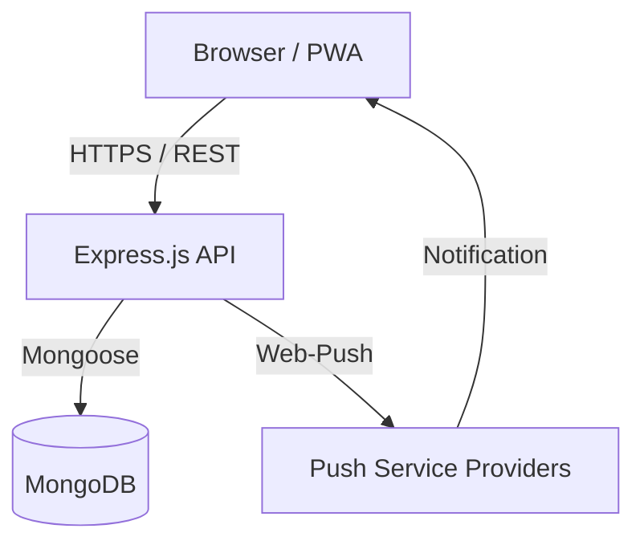

  <h1>GradeBook</h1>
  
<strong>A comprehensive Progressive Web App for education administration</strong>

  
  
  

 

GradeBook is a Progressive Web App built to streamline school administration. It provides a multi-user environment where administrators, teachers, and students interact, track academic progress, and stay updated through real-time push notifications. It provides a native-like experience across desktop and mobile devices.

---

## Core Features

- **Role-Based Access Control**: Dashboards tailored for Admins, Teachers, and Students.
- **Grade & Attendance Tracking**: Monitor student academic performance and session attendance.
- **Real-Time Push Notifications**: Targeted alerts for grades, attendance, and administrative announcements using the Web Push API.
- **Offline Reliability (PWA)**: Installable across Android, iOS, and desktop.
- **Localization**: Full internationalization (i18n) support for Greek and English.
- **Responsive UI/UX**: Built with Tailwind CSS, shadcn/ui, and Radix primitives, featuring dark mode support and dynamic layouts.

---

## Architecture Overview

### System Data Flow

### Component Structure

GradeBook is structured into two main application layers:

1. **Frontend (React / Vite)**:
   - Uses **Redux Toolkit** for predictable state management across complex views.
   - Leverages **Axios** with interceptors for seamless API communication and token refresh handling.
   - Integrates **Service Workers** (`vite-plugin-pwa`) to handle offline fallbacks, asset caching, and background sync.

2. **Backend (Node.js / Express)**:
   - Implements robust middleware for authentication (JWT), error handling, and request validation.
   - Uses **Mongoose** models to manage relationships between users, schools, subjects, and grades.
   - Operates a dedicated notification service responsible for securely managing VAPID keys and dispatching Web Push payloads to subscribed devices.

---

## Technology Stack

### Frontend

- **Framework**: React 18 powered by Vite
- **State Management**: Redux Toolkit
- **Styling**: Tailwind CSS, Framer Motion
- **Components**: shadcn/ui
- **PWA Capabilities**: Workbox
- **Localization**: i18next

### Backend

- **Server**: Node.js, Express.js
- **Database**: MongoDB via Mongoose
- **Authentication**: JWT, bcryptjs
- **Notifications**: Web Push API
- **Security**: Helmet, express-rate-limit, CORS

### Testing & Infrastructure

- **Testing**: Jest, Supertest, MongoDB Memory Server
- **Process Management**: PM2

---

## License

This product is distributed under the MIT License. See the `LICENSE` file for more details.
